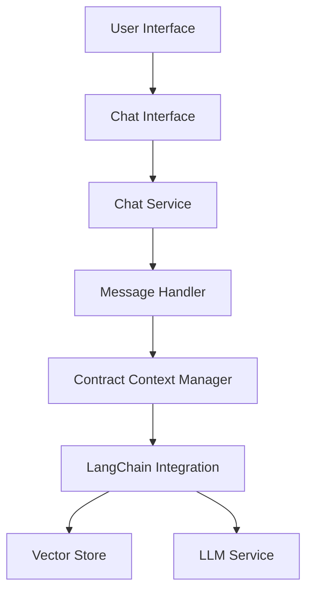

# Contracto - AI-Powered Contract Analysis

A modern contract analysis platform that leverages AI to process, analyze, and compare legal documents.

## Tech Stack

- **Frontend**: Next.js 14.2
- **Backend**: Supabase
- **AI/ML**: LangChain
- **Storage**: Supabase Storage
- **Database**: PostgreSQL (via Supabase)

## Database Schema

Here is the summary for the schema, suitable for your `README.md` file:

---

# **Database Schema Overview**

This document describes the database schema for the **Contract Analysis System**. The system is designed to manage contracts, analyze their contents, store embeddings for search and comparison, and facilitate efficient data retrieval.

---

## **Tables and Their Descriptions**

### 1. **`contract_analysis`**
This table stores detailed analysis of contract data extracted from uploaded files.

| **Column**              | **Type**    | **Description**                                                                 |
|--------------------------|-------------|---------------------------------------------------------------------------------|
| `id`                    | `uuid`      | Primary key for the analysis record.                                           |
| `contract_id`           | `uuid`      | Foreign key referencing the `contracts` table.                                 |
| `effective_date`        | `text`      | The contract's effective start date.                                           |
| `termination_clause`    | `text`      | Details about the termination clause.                                          |
| `payment_terms`         | `text`      | Terms specifying the payment conditions.                                       |
| `late_penalty`          | `text`      | Penalty details for late payments.                                             |
| `delivery_timeline`     | `text`      | Timeline for the delivery of goods/services.                                   |
| `governing_law`         | `text`      | The governing law applicable to the contract.                                  |
| `confidentiality_clause`| `text`      | Information about the confidentiality clause.                                  |
| `arbitration`           | `text`      | Details of arbitration agreements, if any.                                     |
| `score`                 | `int4`      | A calculated score indicating the quality or compliance of the contract.       |
| `edited_at`             | `timestampz`| Timestamp of the last modification.                                            |
| `created_at`            | `timestampz`| Timestamp of the record's creation.                                            |

---

### 2. **`contracts`**
This table holds metadata and embeddings for uploaded contract files.

| **Column**    | **Type**    | **Description**                                                            |
|---------------|-------------|----------------------------------------------------------------------------|
| `id`          | `uuid`      | Primary key for the contract.                                              |
| `file_url`    | `text`      | URL of the uploaded contract file stored in Supabase.                     |
| `original_name` | `text`    | Original name of the uploaded file.                                       |
| `status`      | `text`      | Processing status of the file (e.g., `uploaded`, `processed`).            |
| `size`        | `int8`      | Size of the file in bytes.                                                |
| `metadata`    | `jsonb`     | Additional metadata about the contract (e.g., uploader, tags).            |
| `embedding`   | `vector`    | Vector representation of the contract text for search and comparison.     |
| `created_at`  | `timestampz`| Timestamp of the record's creation.                                       |
| `updated_at`  | `timestampz`| Timestamp of the last update to the record.                               |

---

### 3. **`comparisons`**
This table stores data for contract comparisons.

| **Column**    | **Type**    | **Description**                                                           |
|---------------|-------------|---------------------------------------------------------------------------|
| `id`          | `uuid`      | Primary key for the comparison record.                                   |
| `contract_ids`| `uuid[]`    | Array of contract IDs involved in the comparison.                        |
| `comparison_data` | `jsonb` | JSON containing detailed comparison results (e.g., differences in terms).|
| `created_at`  | `timestampz`| Timestamp of the record's creation.                                      |

---

### 4. **`documents`**
This table stores the extracted text and embeddings for all uploaded documents.

| **Column**    | **Type**    | **Description**                                                           |
|---------------|-------------|---------------------------------------------------------------------------|
| `id`          | `int8`      | Primary key for the document.                                            |
| `content`     | `text`      | Full text content extracted from the document.                           |
| `metadata`    | `jsonb`     | Metadata about the document (e.g., page numbers, keywords).              |
| `embedding`   | `vector`    | Vector representation of the document's content for semantic search.     |

---

## **Relationships**
1. The `contract_analysis` table references the `contracts` table through the `contract_id` column.
2. The `comparisons` table uses `contract_ids` to relate to multiple contracts for comparison purposes.

---

## **Use Cases**
- **Contract Analysis**: Extract and analyze key details from uploaded contracts.
- **Search and Retrieval**: Use embeddings to search for similar contracts or terms.
- **Comparisons**: Compare multiple contracts and identify key differences.
- **Document Management**: Store and manage extracted content and metadata for all uploaded documents.

---

Let me know if you need further adjustments!

## Features

- PDF Document Upload & Processing
- Text Extraction using LangChain's WebPDFLoader
- Document Comparison
- AI-Powered Analysis
- Secure Document Storage
- Vector Embeddings for Semantic Search


**CHATBOT**


Let's design the chatbot architecture for Contracto. Here's a proposed structure:



Key Components:

1. **Frontend**:
```typescript
// src/app/chatbot/page.tsx
- Chat interface with message history
- Real-time responses
- Contract selection/context switching
- Message threading
```

2. **Chat Service**:
```typescript
// src/lib/services/chatService.ts
- Message handling
- Context management
- Contract data retrieval
- Response formatting
```

3. **Vector Store Integration**:
```typescript
// src/lib/services/vectorStoreService.ts
- Store contract embeddings
- Semantic search
- Relevant context retrieval
```

4. **LLM Integration**:
```typescript
// src/lib/services/llmService.ts
- OpenAI/Claude integration
- Prompt engineering
- Response generation
```


